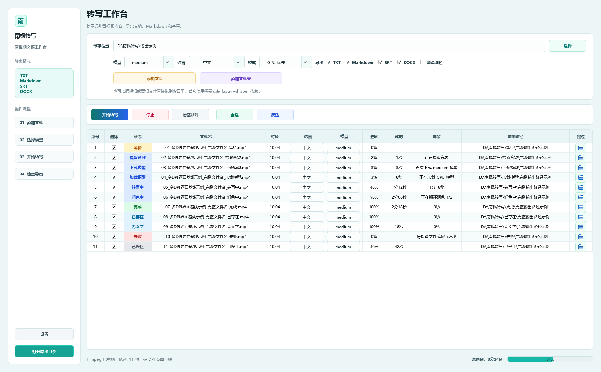

# 南枫转写

面向影视、动画与 VFX 工作流的本地优先批量音视频转写工具。项目基于 Python、PySide6、faster-whisper 和 FFmpeg，支持 Windows 本地转写、GPU/CPU 自动降级、批量队列与多格式导出。

## 软件界面预览



## v1.0.0 功能

- 批量添加视频、音频或整个文件夹，也支持拖放导入。
- 使用 faster-whisper 的 `base`、`small`、`medium`、`large-v3` 模型，默认 `medium`。
- 支持 GPU 优先和 CPU 稳定模式；GPU 环境不可用时可回退 CPU。
- 同一批任务复用模型，GPU 模式支持批量推理和资源不足时逐级降级。
- 每个 Whisper 模型只需成功下载一次，默认长期保存在 `%LOCALAPPDATA%\NanfengTranscriber\models`，升级或重装软件仍会复用。
- 导出 TXT、Markdown、SRT、DOCX。
- 可选调用文本 API，将转写稿翻译、整理为现代简体中文。
- 显示逐项状态、进度、耗时、剩余时间、输出路径和总进度。
- 已有结果可选择覆盖，或跳过后继续处理剩余任务。

## Windows 安装

从 GitHub Releases 下载标注为“Windows 可点击安装包”的 `NanfengTranscriber_Windows_*.zip`，解压后双击其中的 `NanfengTranscriber_Windows_*_Setup_*.exe`。压缩包内的 `安装说明.txt` 以中文为主，英文说明附在文末。

首次使用某个 Whisper 模型时需要联网下载模型文件；以后会强制从本地缓存加载，缓存损坏时才联网修复。安装包尚未进行商业代码签名，Windows SmartScreen 可能显示未知发布者提示。

## 源码运行

环境要求：Python 3.11+、FFmpeg/FFprobe，以及 NVIDIA GPU 可选运行库。

```powershell
python -m pip install -r requirements.txt
python -m unittest discover -s tests -v
python start.py
```

Windows 也可双击 `启动南枫转写_Windows_源码测试.bat`。本地模型文件、日志、构建目录和安装包不会提交到 Git。

## 翻译与润色

“翻译润色”是可选的联网能力，需要配置 `NANZHU_TEXT_API_KEY` 或 `OPENAI_API_KEY`。未配置密钥时，软件只执行本地原始转写，不会上传音视频文件。

API 鉴权失败、请求超时、空响应和异常响应格式均有独立错误提示；错误信息不会回显 API Key 或服务端原始响应。

## 当前验证状态

- 自动化测试覆盖已有结果续跑、API 鉴权/超时/空响应、模型持久缓存、Inno 安装器合同和四档 DPI 截图基线。
- Windows RTX 4090 固定三样本基准中，队列耗时从 130.499 秒降至 28.403 秒。
- macOS 版本尚未实现；迁移要求见 `docs/MAC_CODEX_START_PROMPT.md`。
- 当前技术栈、目录结构与工程事实见 `docs/context.md`；正式经验审计见 `docs/development-experience-audit.md`；动态开发状态见 `docs/CURRENT_HANDOFF.md`；产品与历史经验见 `docs/chatgpt-project-context.md`。

## 许可证

当前仓库未附开源许可证，版权及使用权由项目作者保留。
